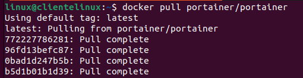
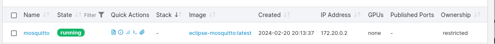

# Portoiner

1. IDescarga de Portainer

   ```bash
    $ docker pull portainer/portainer
   ```



2. Creamos un volumen Docker para la persistencia de datos:

   ```bash
   $ docker volume create portainer_data
   ```

   

3. Comprobamos que existe el volume

   ```bash
   $ docker volume ls
   ```

   

4. Iniciamos portainer

   ```bash
   $ docker run -d -p 9000:9000 --name portainer --restart always -v /var/run/docker.sock:/var/run/docker.sock -v portainer_data:/data portainer/portainer
   ```

   - `-d`: Ejecutar el contenedor en segundo plano.
   - `-p 9000:9000`: Mapear el puerto 9000 del host al puerto 9000 del contenedor.
   - `--name portainer`: Asignar un nombre al contenedor.
   - `--restart always`: Reiniciar el contenedor automáticamente en caso de fallo o reinicio del sistema.
   - `-v /var/run/docker.sock:/var/run/docker.sock`: Proporcionar acceso al socket de Docker para gestionar los contenedores.
   - `-v portainer_data:/data`: Asociar el volumen creado al directorio `/data` dentro del contenedor.

​     5. Accedemos a Portainer

​	

6. Muestra contenedores activos, para un contenedor, borra un contenedor

   - Contenedores activos

   

   - Parar un contenedor lo selecionamos y cliclamos en stop

   

   - Borrar contenedo, selecionamos y clicamos remove

   

7. Muestra alguna operación con redes Docker

   - Creacion de una red con portainer

   

   

   - Creamos un contenedor nuevo con la image de mysql y vamos a utilizar la red creade llamada Mi_red

   

   - Escojo red

   

   - Implemento contenedor, para ello tuve que crea un equipo un usuario y darles permisos.

   

   - Vemos el contendeor creado y est el red creada con ip 172.20.0.2

​	




8. Muestra alguna operación con volúmenes Docker

   - Creo un volumen llamado volumen1

     

     

   - Lo elimino

   

   

