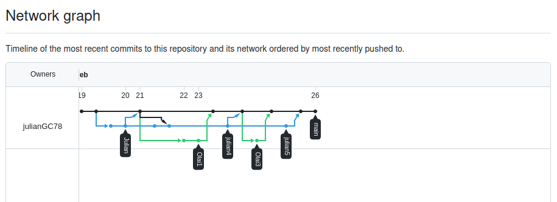

# TareaDocker_EV

> Colaboradores: Julián Grijuela y Olai García

Esta tarea la hemos estructurado de la siguiente forma:

* Ejercicios 1 y 3, fueron realizados por Olai
* Ejercicios 2, 4 y 5 fueron realizados por Julián

En cuanto a los plazos de entrega nos hemos puesto las siguientes fechas:

* Lunes 19/02/2024: Estructuración y planificación del proyecto
* Miércoles 21/02/2024: Entrega de los ejercicios 1, 2 y 4
* Viernes 23/02/2024: Entrega de los ejercicios 3 y 5
* Lunes 26/02/2024: Revisión y planificación de la documentación final
* Miércoles 28/02/2024: Acabar todo y entregar

Por último adjuntamos varias capturas de los insights de GitHub:

Issues:

Commits:

Contributors:

Network:

Estructuración del proyecto:

